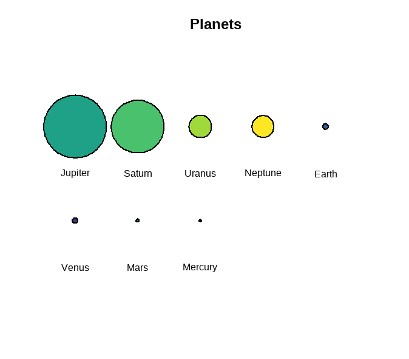
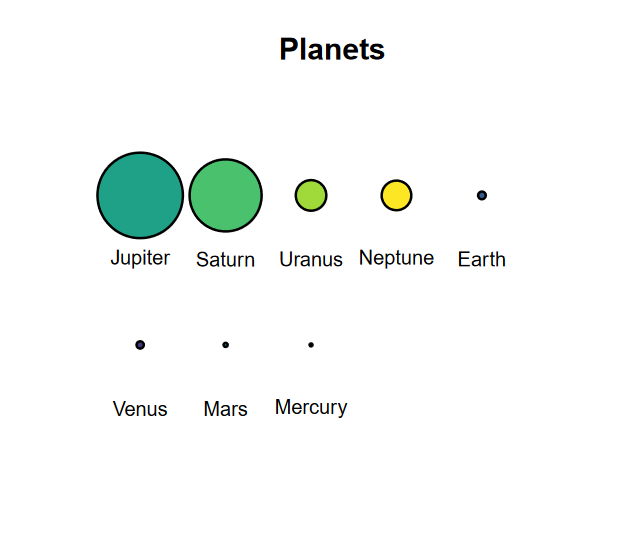

<!-- README.md is generated from README.Rmd. Please edit that file -->

# circlesplot <a href="https://github.com/BenSt099/circlesplot"></a>

<!-- badges: start -->

[](https://github.com/BenSt099/circlesplot/actions/workflows/R-CMD-check.yaml)
[](https://cran.r-project.org/package=circlesplot)
<!-- badges: end -->

## Overview

The **circlesplot** library helps you display proportions between
different objects. Say earth is 3.6 times bigger than the moon. How can
you visualize that? It would be helpful if you could draw earth and moon
with their exact diameter to make your readers aware of the difference
in size. This is where the lib comes into play. It plots two circles
with the given diameter next to each other, so readers can observe the
ratio. Although it is extremely helpful to visualize planets, it can
also be used for other things too.

## Installation

Install the latest version from **CRAN**:

``` r
install.packages("circlesplot")
```

or the development version from
[GitHub](https://github.com/BenSt099/circlesplot):

``` r
install.packages("devtools")
devtools::install_github("BenSt099/circlesplot")
```

## Usage

You can start by plotting the solar system and its planets:

``` r
library('circlesplot')
library('viridis')

planets = c('Mercury','Venus','Earth','Mars','Jupiter','Saturn','Uranus','Neptune')
diameter = c(4879.4,12103.6,12756.3,6792.4,142984,120536,51118,49528)

circlesplot(cp_vals=diameter, cp_text=planets, cp_max=4L, cp_title="Planets", cp_color=viridis(8), cp_sort='desc')
```




The left plot is exported as *png*, while the right is exported as
*pdf*.

## Known issues

You may see something unexpected in *RStudio*: When you create the plot
and it is displayed in the lower right window (in the plots tab), it
seems like that a part of the plot is cut off or it’s displayed very
small. This only happens due to the size of the lower right window.
Either resize it or use the following r code to save the plot as *pdf*:

``` r
pdf("path/to/your/pdf/plot1.pdf")
circlesplot(cp_vals=diameter, cp_text=planets, cp_max=4L, cp_color=viridis(8), cp_title="Planets", cp_sort='desc')
dev.off() 
```

## Help

If you need help, take a deeper look into the
[manual](https://benst099.github.io/circlesplot/articles/cp_vignette.html)
or open an issue [here](https://github.com/BenSt099/circlesplot/issues).

## License

This project is licensed under MIT License.
